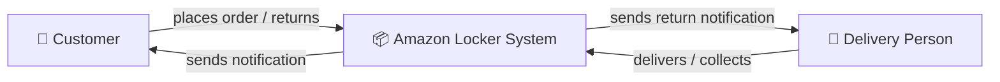
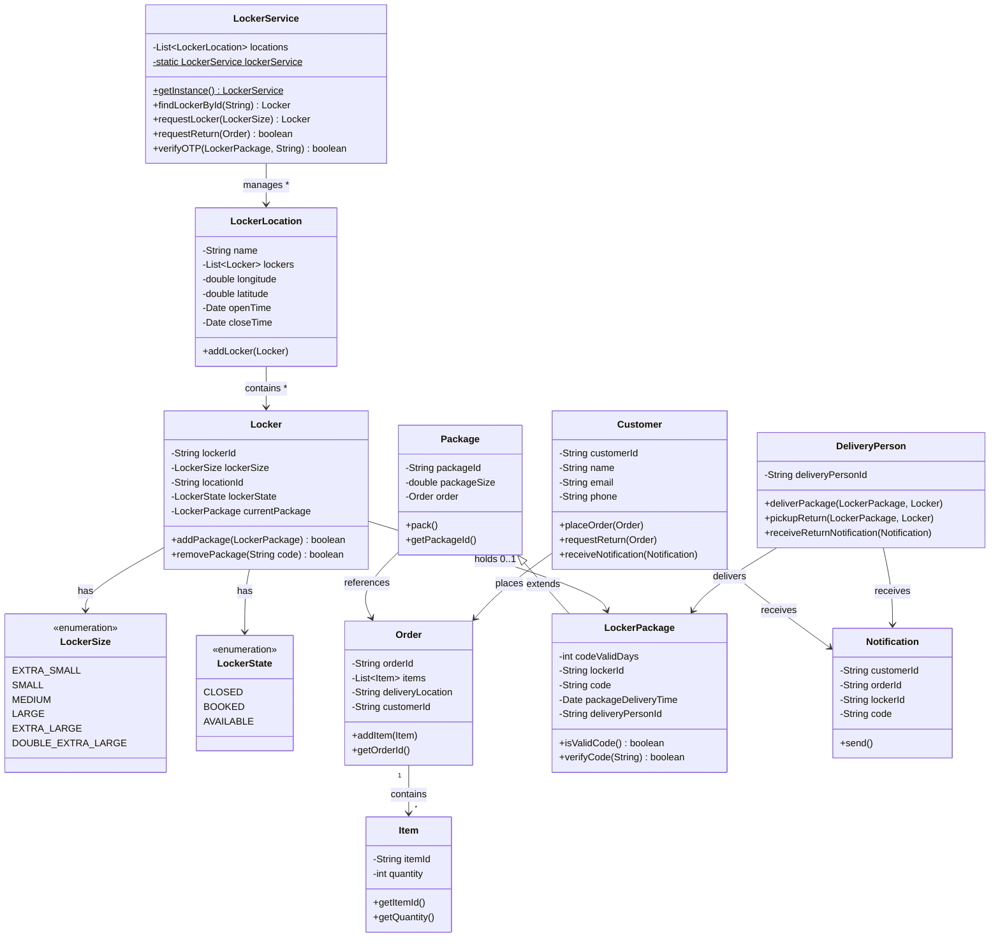
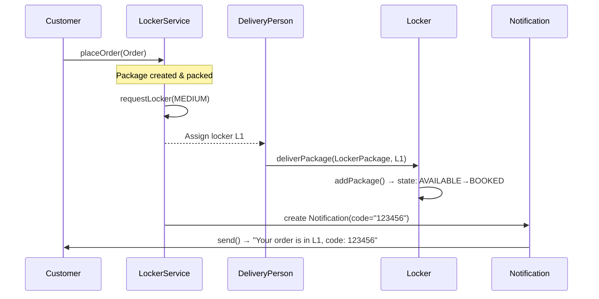
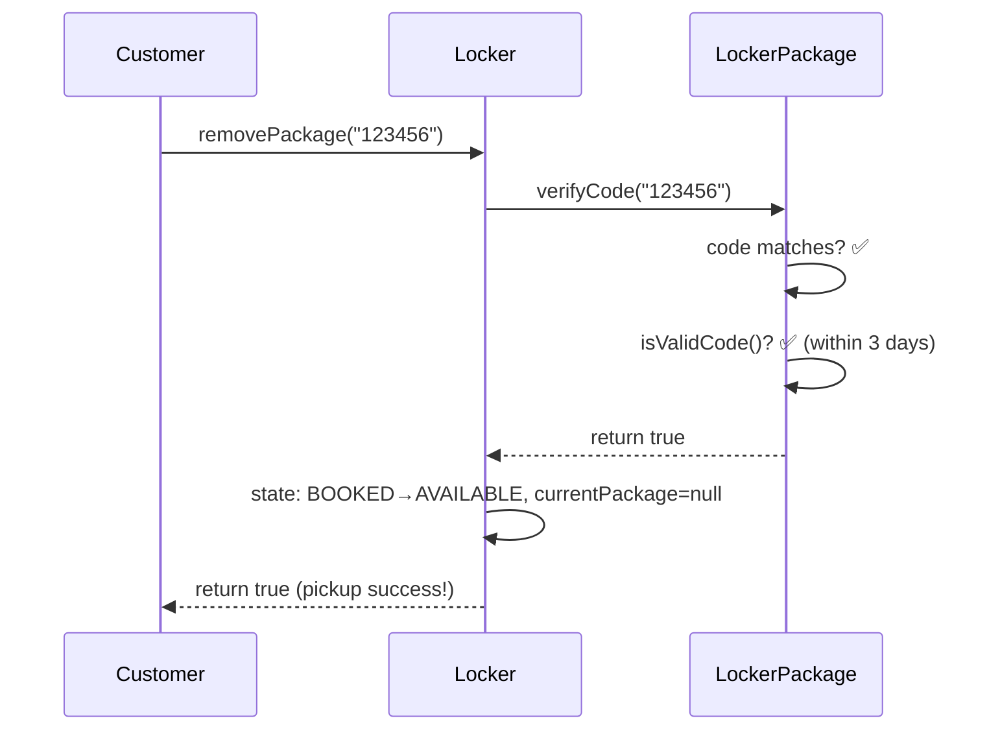
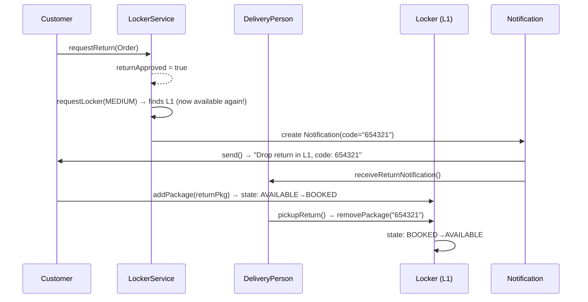
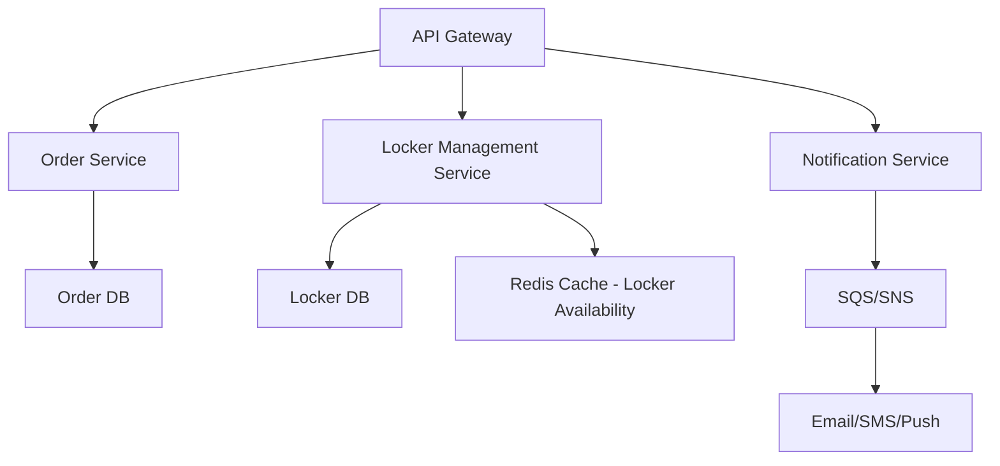

# 📦 Amazon Locker System — Complete Low-Level Design Guide

> **Purpose**: Interview-ready deep-dive for SDE 1. Master every class, relationship, design pattern, and trade-off so you can whiteboard this system from scratch.

---

## Table of Contents

1. [Problem Statement & Requirements](#1-problem-statement--requirements)
2. [System Actors](#2-system-actors)
3. [Class Diagram](#3-class-diagram)
4. [Design Patterns Used](#4-design-patterns-used)
5. [File-by-File Deep Dive](#5-file-by-file-deep-dive)
6. [End-to-End Flow Walkthrough](#6-end-to-end-flow-walkthrough)
7. [Interview Tips & Common Questions](#7-interview-tips--common-questions)
8. [Potential Improvements & Follow-ups](#8-potential-improvements--follow-ups)

---

## 1. Problem Statement & Requirements

### What is Amazon Locker?

Amazon Locker is a **self-service kiosk** located in retail stores, malls, and other public areas. Customers select a nearby locker during checkout, and their packages are delivered there. They receive an **OTP (pickup code)** via notification, go to the locker, enter the code, and retrieve their package. The system also supports **returns** — customers drop a package back, and a delivery person collects it.

### Functional Requirements

| # | Requirement | How This Codebase Handles It |
|---|-------------|------------------------------|
| 1 | Customer places an order and opts for locker delivery | `Customer.placeOrder()` + `Order` creation |
| 2 | System assigns an available locker of the right size | `LockerService.requestLocker(LockerSize)` |
| 3 | Delivery person deposits package in locker | `DeliveryPerson.deliverPackage()` → `Locker.addPackage()` |
| 4 | Customer receives notification with OTP | `Notification.send()` + `Customer.receiveNotification()` |
| 5 | Customer picks up package using OTP | `Locker.removePackage(code)` → `LockerPackage.verifyCode()` |
| 6 | OTP has an expiry window (N days) | `LockerPackage.isValidCode()` checks time-based expiry |
| 7 | Customer can initiate a return | `Customer.requestReturn()` → `LockerService.requestReturn()` |
| 8 | Delivery person picks up return from locker | `DeliveryPerson.pickupReturn()` |
| 9 | Multiple locker locations with multiple lockers | `LockerLocation` → `List<Locker>`, `LockerService` → `List<LockerLocation>` |

### Non-Functional Requirements (to discuss in interview)

- **Scalability**: Support thousands of locker locations
- **Concurrency**: Multiple customers may try to book the same locker simultaneously
- **Availability**: System must be highly available — package pickups are time-critical
- **Security**: OTP-based authentication for package access

---

## 2. System Actors



| Actor | Class | Responsibilities |
|-------|-------|-----------------|
| **Customer** | [Customer.java](file:///c:/Users/shabbir/Desktop/LOW%20LEVEL%20DESIGn/AmazonLockerSystem_Educative/Customer.java) | Places orders, requests returns, receives notifications |
| **Delivery Person** | [DeliveryPerson.java](file:///c:/Users/shabbir/Desktop/LOW%20LEVEL%20DESIGn/AmazonLockerSystem_Educative/DeliveryPerson.java) | Delivers packages to lockers, picks up returns |
| **Locker Service (System)** | [LockerService.java](file:///c:/Users/shabbir/Desktop/LOW%20LEVEL%20DESIGn/AmazonLockerSystem_Educative/LockerService.java) | Manages all locations, finds lockers, verifies OTPs |

---

## 3. Class Diagram



---

## 4. Design Patterns Used

### 4.1 Singleton Pattern — `LockerService`

```java
// File: LockerService.java
private static LockerService lockerService = null;

private LockerService() {                // ← private constructor
    this.locations = new ArrayList<>();
}

public static LockerService getInstance() {
    if (lockerService == null) {
        lockerService = new LockerService();
    }
    return lockerService;
}
```

> [!IMPORTANT]
> **Why Singleton?** There should be exactly **ONE** LockerService managing ALL locker locations across the system. Creating multiple instances would lead to inconsistent state — one instance might think a locker is available while another has already booked it.

**Interview follow-up**: "Is this Singleton thread-safe?" → **No.** If two threads call `getInstance()` simultaneously when `lockerService` is still `null`, both may create separate instances. Fix: use `synchronized`, double-checked locking, or eager initialization.

### 4.2 Inheritance — `Package` → `LockerPackage`

```java
public class LockerPackage extends Package {
    // Adds locker-specific fields: code, lockerId, codeValidDays, etc.
}
```

> [!TIP]
> `Package` is a generic concept — it just has an ID, size, and order reference. `LockerPackage` **IS-A** `Package` with additional locker-specific behavior (OTP verification, code expiry). This is textbook **IS-A inheritance**.

### 4.3 Composition — throughout the design

| Container | Contains | Relationship Type |
|-----------|----------|-------------------|
| `Order` | `List<Item>` | **HAS-MANY** (composition) |
| `LockerLocation` | `List<Locker>` | **HAS-MANY** (composition) |
| `LockerService` | `List<LockerLocation>` | **HAS-MANY** (composition) |
| `Locker` | `LockerPackage` | **HAS-A** (0 or 1, association) |
| `Package` | `Order` | **HAS-A** (association) |

### 4.4 Enum-based State Management

Instead of raw strings or integers, locker state and size are modeled as **enums** — making the code type-safe and self-documenting:

- `LockerState` → `CLOSED`, `BOOKED`, `AVAILABLE`
- `LockerSize` → `EXTRA_SMALL` through `DOUBLE_EXTRA_LARGE`

---

## 5. File-by-File Deep Dive

### 5.1 `LockerSize.java` — [View Source](file:///c:/Users/shabbir/Desktop/LOW%20LEVEL%20DESIGn/AmazonLockerSystem_Educative/LockerSize.java)

```java
public enum LockerSize {
    EXTRA_SMALL, SMALL, MEDIUM, LARGE, EXTRA_LARGE, DOUBLE_EXTRA_LARGE
}
```

**Purpose**: Defines the 6 physical locker sizes. When a package needs a locker, the system matches its size to an available locker of the right `LockerSize`.

**Why an enum?**
- Prevents invalid sizes like `"SUPER_MEGA"` at compile time
- Can be used in `==` comparisons (vs `.equals()` for strings)
- Can later add methods like `fitsPackage(double packageSize)` to the enum itself

---

### 5.2 `LockerState.java` — [View Source](file:///c:/Users/shabbir/Desktop/LOW%20LEVEL%20DESIGn/AmazonLockerSystem_Educative/LockerState.java)

```java
public enum LockerState {
    CLOSED, BOOKED, AVAILABLE
}
```

**Purpose**: Tracks the lifecycle state of each locker:

| State | Meaning | Transitions To |
|-------|---------|---------------|
| `AVAILABLE` | Empty, ready for a new package | `BOOKED` (when a package is placed) |
| `BOOKED` | Contains a package | `AVAILABLE` (when package is picked up) |
| `CLOSED` | Out of service / maintenance | `AVAILABLE` (after maintenance) |

> [!NOTE]
> The `CLOSED` state is defined but **not used** in the current codebase. In an interview, mention this shows future extensibility — lockers can be taken offline for maintenance.

---

### 5.3 `Item.java` — [View Source](file:///c:/Users/shabbir/Desktop/LOW%20LEVEL%20DESIGn/AmazonLockerSystem_Educative/Item.java)

```java
public class Item {
    private String itemId;
    private int quantity;
    // constructor, getters, setters, toString
}
```

**Purpose**: Represents a single product line in an order (e.g., "2 units of Item X"). An `Order` has a `List<Item>`.

**Key design point**: `Item` is a pure **data class** (POJO) — no business logic, just state. This follows the **Single Responsibility Principle** (SRP).

---

### 5.4 `Order.java` — [View Source](file:///c:/Users/shabbir/Desktop/LOW%20LEVEL%20DESIGn/AmazonLockerSystem_Educative/Order.java)

```java
public class Order {
    private String orderId;
    private List<Item> items;
    private String deliveryLocation;
    private String customerId;

    public void addItem(Item item) { items.add(item); }
}
```

**Purpose**: Represents a customer's order — what items, where to deliver, and who placed it.

**Relationships**:
- `Order` → `List<Item>` — **one-to-many composition**
- `Order` ← `Package` — a package wraps one order for delivery
- `Order` is linked to `Customer` via `customerId` (loose coupling via ID, not direct object reference)

> [!TIP]
> **Why `customerId` instead of a `Customer` object?** This is a design choice for loose coupling. In a real system with microservices, the order service might not have direct access to the customer object — it only knows the customer ID.

---

### 5.5 `Package.java` — [View Source](file:///c:/Users/shabbir/Desktop/LOW%20LEVEL%20DESIGn/AmazonLockerSystem_Educative/Package.java)

```java
public class Package {
    private String packageId;
    private double packageSize;
    private Order order;

    public void pack() {
        System.out.println("Packing package " + packageId + " for order " + order.getOrderId());
    }
}
```

**Purpose**: A physical shipment container that wraps an `Order`. This is the **base class** for `LockerPackage`.

**Why separate from `Order`?**
- One order might be split into **multiple packages** (e.g., heavy item shipped separately)
- `Package` has physical attributes like `packageSize` that don't belong on `Order`
- Follows the **Open/Closed Principle** — you can extend `Package` into `LockerPackage`, `HomeDeliveryPackage`, etc. without modifying the base class

---

### 5.6 `LockerPackage.java` — [View Source](file:///c:/Users/shabbir/Desktop/LOW%20LEVEL%20DESIGn/AmazonLockerSystem_Educative/LockerPackage.java)

```java
public class LockerPackage extends Package {
    private int codeValidDays;    // OTP validity window
    private String lockerId;      // which locker this package goes to
    private String code;          // the OTP/pickup code
    private Date packageDeliveryTime;  // when it was delivered
    private String deliveryPersonId;    // who delivered it
}
```

**This is one of the MOST IMPORTANT classes in the system.** It contains the core business logic:

#### OTP Expiry Check — `isValidCode()`

```java
public boolean isValidCode() {
    Date now = new Date();
    long diffInMillis = now.getTime() - packageDeliveryTime.getTime();
    long diffInDays = diffInMillis / (1000 * 60 * 60 * 24);
    return diffInDays <= codeValidDays;
}
```

**How it works**: Calculates the number of days since the package was delivered. If it exceeds `codeValidDays`, the code is expired. In reality, Amazon gives you **3 days** to pick up.

#### OTP Verification — `verifyCode()`

```java
public boolean verifyCode(String code) {
    if (!this.code.equals(code)) return false;     // wrong code
    if (!isValidCode()) return false;               // code expired
    return true;                                     // ✅ success
}
```

**Two-step verification**: First checks if the code **matches**, then checks if it's **not expired**. This is a **critical security gate** in the system.

> [!CAUTION]
> **Interview insight**: If the code expires, what happens to the package? In real Amazon, it gets **returned to the fulfillment center**. This codebase doesn't implement that automatic return, which is a good discussion point about improvements.

---

### 5.7 `Locker.java` — [View Source](file:///c:/Users/shabbir/Desktop/LOW%20LEVEL%20DESIGn/AmazonLockerSystem_Educative/Locker.java)

```java
public class Locker {
    private String lockerId;
    private LockerSize lockerSize;
    private String locationId;
    private LockerState lockerState;        // tracks current state
    private LockerPackage currentPackage;   // 0 or 1 package at a time
}
```

**This class manages the physical locker's lifecycle.** Two critical methods:

#### `addPackage()` — Deposit

```java
public boolean addPackage(LockerPackage pkg) {
    if (lockerState != LockerState.AVAILABLE) {
        return false;                          // Guard: locker must be available
    }
    this.currentPackage = pkg;
    lockerState = LockerState.BOOKED;          // State transition: AVAILABLE → BOOKED
    return true;
}
```

#### `removePackage()` — Pickup

```java
public boolean removePackage(String code) {
    if (lockerState != LockerState.BOOKED || currentPackage == null) {
        return false;                          // Guard: must have a package
    }
    if (!currentPackage.verifyCode(code)) {
        return false;                          // Guard: OTP must be valid
    }
    this.currentPackage = null;
    lockerState = LockerState.AVAILABLE;       // State transition: BOOKED → AVAILABLE
    return true;
}
```

> [!IMPORTANT]
> **State machine pattern**: The `Locker` class implements a mini state machine:
> ```
> AVAILABLE ──addPackage()──→ BOOKED ──removePackage()──→ AVAILABLE
> ```
> Each method enforces valid transitions with guard conditions.

---

### 5.8 `LockerLocation.java` — [View Source](file:///c:/Users/shabbir/Desktop/LOW%20LEVEL%20DESIGn/AmazonLockerSystem_Educative/LockerLocation.java)

```java
public class LockerLocation {
    private String name;
    private List<Locker> lockers;      // all lockers at this location
    private double longitude;
    private double latitude;           // geo-coordinates for proximity search
    private Date openTime;
    private Date closeTime;            // operating hours
}
```

**Purpose**: A physical site (e.g., "Whole Foods Downtown") containing multiple lockers. Models real-world constraints:
- **Location** (lat/long) for finding nearest locker to the customer
- **Operating hours** — lockers shouldn't be accessible outside store hours

**Relationship**: `LockerService` → `List<LockerLocation>` → `List<Locker>` — a **two-level hierarchy**.

---

### 5.9 `LockerService.java` — [View Source](file:///c:/Users/shabbir/Desktop/LOW%20LEVEL%20DESIGn/AmazonLockerSystem_Educative/LockerService.java)

**The central orchestrator of the system.** Singleton pattern.

#### Finding a Locker by ID — `findLockerById()`

```java
public Locker findLockerById(String lockerId) {
    for (LockerLocation loc : locations) {
        for (Locker l : loc.getLockers()) {
            if (l.getLockerId().equals(lockerId)) return l;
        }
    }
    return null;
}
```

Uses a **nested loop** to search all lockers across all locations. In a real system, you'd use a `HashMap<String, Locker>` for O(1) lookup.

#### Assigning a Locker — `requestLocker()`

```java
public Locker requestLocker(LockerSize size) {
    for (LockerLocation loc : locations) {
        for (Locker l : loc.getLockers()) {
            if (l.getLockerState() == LockerState.AVAILABLE && l.getLockerSize() == size) {
                return l;  // returns FIRST available match
            }
        }
    }
    return null;  // no available locker found
}
```

**Algorithm**: Linear scan across all locations → all lockers → return first available locker matching the requested size.

> [!WARNING]
> **Thread-safety issue**: If two requests hit `requestLocker()` at the same time, both could get the same locker before either calls `addPackage()`. Fix: synchronize the method or use an `AtomicReference` + CAS.

#### Other Methods

| Method | Purpose |
|--------|---------|
| `requestReturn(Order)` | Logs and approves a return request |
| `verifyOTP(LockerPackage, String)` | Delegates to `LockerPackage.verifyCode()` |

---

### 5.10 `Customer.java` — [View Source](file:///c:/Users/shabbir/Desktop/LOW%20LEVEL%20DESIGn/AmazonLockerSystem_Educative/Customer.java)

```java
public class Customer {
    private String customerId, name, email, phone;

    public void placeOrder(Order order) { ... }
    public void requestReturn(Order order) { ... }
    public void receiveNotification(Notification notification) { ... }
}
```

**Purpose**: Actor class representing the customer. Three responsibilities matching the three main use cases. Currently uses `System.out.println` — in production, these would trigger API calls.

---

### 5.11 `DeliveryPerson.java` — [View Source](file:///c:/Users/shabbir/Desktop/LOW%20LEVEL%20DESIGn/AmazonLockerSystem_Educative/DeliveryPerson.java)

```java
public class DeliveryPerson {
    private String deliveryPersonId;

    public void deliverPackage(LockerPackage pkg, Locker locker) { ... }
    public void pickupReturn(LockerPackage pkg, Locker locker) { ... }
    public void receiveReturnNotification(Notification notification) { ... }
}
```

**Key method — `deliverPackage()`**:
```java
public void deliverPackage(LockerPackage pkg, Locker locker) {
    if (locker.addPackage(pkg)) {  // delegates to Locker's state machine
        System.out.println("Delivered package " + pkg.getPackageId() + " to locker " + locker.getLockerId());
    }
}
```

Notice the **delegation**: `DeliveryPerson` doesn't directly manipulate locker state — it calls `locker.addPackage()`, which enforces the state machine rules. This is good **encapsulation**.

---

### 5.12 `Notification.java` — [View Source](file:///c:/Users/shabbir/Desktop/LOW%20LEVEL%20DESIGn/AmazonLockerSystem_Educative/Notification.java)

```java
public class Notification {
    private String customerId, orderId, lockerId, code;

    public void send() {
        System.out.println("Notification sent to customer " + customerId +
            ": Your order " + orderId + " has been placed in locker " + lockerId +
            ". Pickup code: " + code);
    }
}
```

**Purpose**: Carries the pickup information (locker ID + OTP code) to the customer. In a real system, `send()` would trigger SMS, email, or push notification via a notification service.

---

### 5.13 `Driver.java` — [View Source](file:///c:/Users/shabbir/Desktop/LOW%20LEVEL%20DESIGn/AmazonLockerSystem_Educative/Driver.java)

The demo/test class that simulates three real-world scenarios end-to-end. Covered in the next section.

---

## 6. End-to-End Flow Walkthrough

The [Driver.java](file:///c:/Users/shabbir/Desktop/LOW%20LEVEL%20DESIGn/AmazonLockerSystem_Educative/Driver.java) demonstrates 3 scenarios. Here's exactly what happens at each step:

### Scenario 1: Order → Deliver → Notify



**Code trace**:
1. `Customer("CUST1")` places `Order("ORD1")` with `Item("ITM1", 2)`
2. `Package("PKG1", 2.5, order)` is created and `pack()` is called
3. `lockerService.requestLocker(MEDIUM)` → scans all locations → finds `Locker("L1")` available
4. `LockerPackage` is created with code `"123456"`, valid for 3 days
5. `deliveryGuy.deliverPackage(lpkg, locker1)` → calls `locker1.addPackage()` → state changes to `BOOKED`
6. `Notification` is created and `send()` is called → customer receives OTP

### Scenario 2: Customer Picks Up Package



**Code trace**:
1. `assignedLocker.removePackage("123456")` is called
2. Guard check: `lockerState == BOOKED?` → yes ✅
3. `currentPackage.verifyCode("123456")` → code matches, `isValidCode()` → within 3-day window ✅
4. `currentPackage` is set to `null`, state → `AVAILABLE`
5. Returns `true` → customer successfully picks up package

### Scenario 3: Customer Returns a Package



**Code trace**:
1. `customer.requestReturn(order)` — customer initiates return
2. `lockerService.requestReturn(order)` returns `true` (approved)
3. `lockerService.requestLocker(MEDIUM)` → `L1` is now `AVAILABLE` again (freed in Scenario 2)
4. New `LockerPackage("PKG1-R")` created with return OTP `"654321"`
5. Customer is notified of the return locker + code
6. Delivery person gets notified about the expected return
7. Customer places the return package in `L1` via `returnLocker.addPackage(returnPkg)`
8. Delivery person picks it up via `deliveryGuy.pickupReturn(returnPkg, returnLocker)` → calls `removePackage("654321")`

> [!NOTE]
> **Locker reuse**: Notice that **L1** is used for both delivery and return because it became `AVAILABLE` after the pickup in Scenario 2. This demonstrates the full lifecycle: `AVAILABLE → BOOKED → AVAILABLE → BOOKED → AVAILABLE`.

---

## 7. Interview Tips & Common Questions

### 🎯 How to Present This in an Interview

**Step 1 — Gather requirements** (2 min): Ask the interviewer about scope. "Should I design for returns? Multiple locations? OTP expiry?"

**Step 2 — Identify actors & use cases** (1 min): Customer, DeliveryPerson, System. Use cases: place order, deliver, pickup, return.

**Step 3 — Core classes** (3 min): Draw the class diagram. Start with enums (`LockerSize`, `LockerState`), then data classes (`Item`, `Order`, `Package`), then core classes (`Locker`, `LockerPackage`, `LockerLocation`), then the service (`LockerService`).

**Step 4 — Key methods** (5 min): Walk through `addPackage()`, `removePackage()`, `verifyCode()`, `requestLocker()`.

**Step 5 — Design patterns** (2 min): Singleton for `LockerService`, Inheritance for `Package→LockerPackage`, State Machine in `Locker`.

### ❓ Commonly Asked Follow-Up Questions

| Question | How to Answer |
|----------|---------------|
| "How would you handle concurrency?" | Use `synchronized` on `requestLocker()` and `addPackage()`, or use a database with row-level locking / optimistic locking |
| "What if no lockers are available?" | Return null, notify customer, offer home delivery fallback or queue them for the next available locker |
| "How would you handle OTP security?" | Hash the OTP (don't store plain text), rate-limit verification attempts, use time-based OTPs (TOTP) |
| "How would you scale this?" | Partition by geography, use a distributed cache for locker availability, async notifications via message queue |
| "What design patterns are used?" | Singleton (LockerService), Inheritance (Package→LockerPackage), Composition (Order→Items), State Machine (Locker states) |
| "How would you find the nearest locker?" | Use `LockerLocation`'s lat/long with a geo-spatial index. KD-tree or geohashing for efficient proximity queries |
| "What happens when the OTP expires?" | Automatically return the package to the fulfillment center. This requires a scheduled job/cron that scans all `BOOKED` lockers for expired codes |

---

## 8. Potential Improvements & Follow-ups

These are things you can **proactively mention** to impress the interviewer:

### Code-Level Improvements

| Improvement | Current State | Better Approach |
|-------------|---------------|-----------------|
| **Thread safety** | Singleton is not thread-safe | Double-checked locking or `enum` singleton |
| **Locker lookup** | O(n²) nested loop in `findLockerById` | `HashMap<String, Locker>` for O(1) |
| **Size matching** | Exact size match only | "Best fit" — a SMALL package can go in a MEDIUM locker if no SMALL is available |
| **OTP storage** | Plain text | BCrypt hash, only compare hashes |
| **Notification** | Synchronous `System.out` | Async via Observer pattern or message queue (SQS/SNS) |
| **Error handling** | Returns boolean / null | Throw custom exceptions (`LockerFullException`, `InvalidCodeException`) |

### Architectural Improvements

1. **Observer Pattern for Notifications**: Instead of the driver manually creating notifications, `Locker` could notify subscribers when its state changes
2. **Strategy Pattern for Locker Selection**: Replace the simple linear scan with pluggable strategies (nearest, cheapest, best-fit size)
3. **Factory Pattern for Packages**: Create a `PackageFactory` that picks the right `Package` subclass based on delivery type
4. **Database Integration**: Replace in-memory lists with a database. `LockerService` becomes a DAO/Repository layer
5. **Scheduled Cleanup Job**: A background thread that scans for expired codes and returns packages automatically
6. **Audit Trail**: Log all state transitions (who placed, who picked up, timestamps) for dispute resolution

### System Design Extension (if interviewer asks to scale up)



---

> [!TIP]
> **Final advice**: In the interview, don't just write code. **Narrate your thinking**: "I'm using a Singleton here because..." "This enum prevents invalid states at compile time..." "I could improve this by..." Interviewers want to see your **thought process**, not just the final answer.

Good luck !
