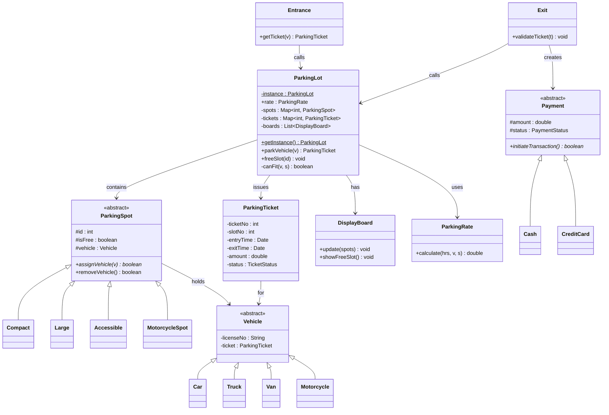
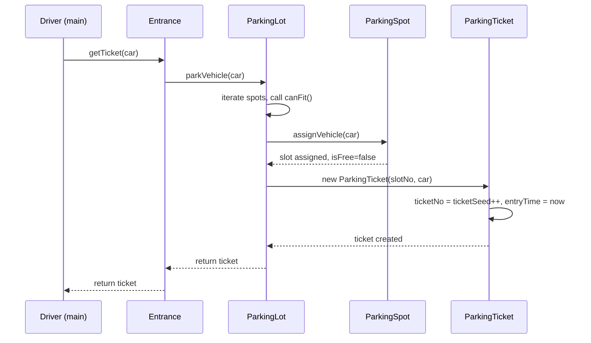
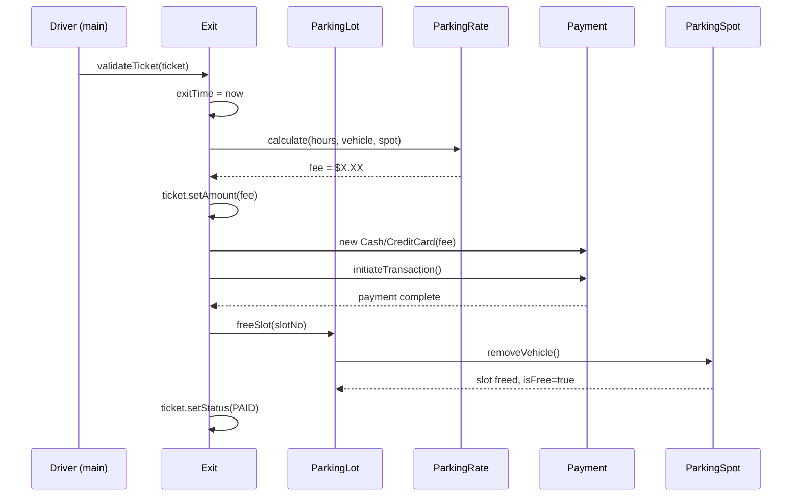

# 🅿️ Parking Lot — Complete LLD Coaching Guide

---

## 📌 Step 0: Problem Context

The goal is to design a robust Parking Lot system. Consider the following playbook:

1. **Clarify requirements** (2-3 min) — ask questions
2. **Identify core use-cases** (1 min) — list them
3. **Design the class diagram** (5-7 min) — on whiteboard/paper
4. **Walk through code** (15-20 min) — write clean OOP
5. **Discuss trade-offs** (5 min) — patterns, concurrency, extensibility

---

## 📌 Step 1: Requirements Gathering (What to clarify)

> [!IMPORTANT]
> **Never** start coding without clarifying requirements. It shows technical maturity.

### Functional Requirements
| # | Question to Ask | Why It Matters |
|---|----------------|----------------|
| 1 | How many floors / levels? | Decides if you need a `ParkingFloor` class |
| 2 | What types of vehicles? | Determines `Vehicle` hierarchy |
| 3 | What types of parking spots? | Determines `ParkingSpot` hierarchy |
| 4 | Multiple entrances/exits? | Need `Entrance` / `Exit` classes |
| 5 | How is payment handled? | Cash, card, UPI → `Payment` Strategy |
| 6 | Is there a display board? | Need `DisplayBoard` for availability |
| 7 | Hourly rate or flat rate? | Decides `ParkingRate` logic |
| 8 | Is there an admin panel? | Need `Admin` actor class |

### Use Cases Derived from This Codebase
1. **Customer enters** → gets a ticket → car is assigned a spot
2. **Customer exits** → pays fee → spot is freed
3. **Lot full** → new car is denied entry
4. **Display board** → shows live availability by spot type
5. **Admin** → can add/remove spots, entrances, boards

---

## 📌 Step 2: The Big Picture — Class Diagram



---

## 📌 Step 3: Design Patterns Used

### 1️⃣ Singleton Pattern — `ParkingLot`

**Why?** There is only ONE parking lot in the system. Every entrance, exit, and display board must refer to the **same** instance.

```java
// Private constructor — nobody can do "new ParkingLot()"
private ParkingLot() {}

private static ParkingLot instance = null;

// Global access point — thread-unsafe version (discuss tradeoffs)
public static ParkingLot getInstance() {
    if (instance == null) instance = new ParkingLot();
    return instance;
}
```

> [!TIP]
> **Follow-up**: *"Is this thread-safe?"*
> Answer: No. For thread safety, use **double-checked locking** or an **enum singleton**.
> ```java
> public static synchronized ParkingLot getInstance() { ... }
> // OR better — double-checked locking:
> public static ParkingLot getInstance() {
>     if (instance == null) {
>         synchronized (ParkingLot.class) {
>             if (instance == null) instance = new ParkingLot();
>         }
>     }
>     return instance;
> }
> ```

### 2️⃣ Inheritance + Polymorphism — `ParkingSpot` & `Vehicle` Hierarchies

**Why?** Different spot types have different allocation logic. Different vehicle types need to match compatible spots.

```
ParkingSpot (abstract)
  ├── Compact        → fits Car
  ├── Large          → fits Truck, Van
  ├── Accessible     → fits Car (handicapped)
  └── MotorcycleSpot → fits Motorcycle

Vehicle (abstract)
  ├── Car
  ├── Truck
  ├── Van
  └── Motorcycle
```

The `assignVehicle()` method is declared `abstract` in `ParkingSpot` and each subclass implements it:

```java
// In Compact.java
public boolean assignVehicle(Vehicle v) {
    if (isFree) {
        this.vehicle = v; isFree = false; return true;
    }
    return false;
}
```

### 3️⃣ Strategy Pattern — `Payment`

**Why?** Payment method can vary (cash, credit card, UPI). Each is a **strategy**.

```java
public abstract class Payment {
    protected double amount;
    protected PaymentStatus status;
    public abstract boolean initiateTransaction(); // strategy method
}

public class Cash extends Payment { ... }
public class CreditCard extends Payment { ... }
```

In `Exit.java`, the strategy is **chosen at runtime**:
```java
Payment p = (fee > 10) ? new CreditCard(fee) : new Cash(fee);
p.initiateTransaction();
```

### 4️⃣ Enums for State Management

Three enums capture the lifecycle states:

| Enum | Values | Used In |
|------|--------|---------|
| `TicketStatus` | ISSUED, IN_USE, PAID, VALIDATED, CANCELED, REFUNDED | `ParkingTicket` |
| `PaymentStatus` | COMPLETED, FAILED, PENDING, UNPAID, REFUNDED | `Payment` |
| `AccountStatus` | ACTIVE, CLOSED, CANCELED, BLOCKLISTED, NONE | `Account` |

---

## 📌 Step 4: Every Class Explained — WHY It Exists

### Core Classes

#### `ParkingLot` — The God Object (Singleton)

| Responsibility | How |
|---------------|-----|
| Holds all spots | `Map<Integer, ParkingSpot> spots` |
| Holds all tickets | `Map<Integer, ParkingTicket> tickets` |
| Parks a vehicle | `parkVehicle()` — finds a free compatible spot |
| Frees a spot | `freeSlot()` — marks spot as available |
| Decides compatibility | `canFit()` — matches vehicle type to spot type |

**The `canFit()` method is the BRAIN of the system:**
```java
private boolean canFit(Vehicle v, ParkingSpot s) {
    if (v instanceof Motorcycle && s instanceof MotorcycleSpot) return true;
    if ((v instanceof Truck || v instanceof Van) && s instanceof Large) return true;
    if (v instanceof Car && (s instanceof Compact || s instanceof Accessible)) return true;
    return false;
}
```

> [!WARNING]
> `instanceof` chains are a **code smell**. A common follow-up question is: *"How would you improve this?"*
> Answer: Use a **mapping table** or the **Visitor pattern**. For example:
> ```java
> Map<Class<? extends Vehicle>, Set<Class<? extends ParkingSpot>>> fitMap;
> ```

#### `ParkingSpot` (abstract) — A Physical Parking Space

- Has an `id`, `isFree` flag, and a reference to the `Vehicle` parked in it
- `assignVehicle()` is abstract — each subclass prints its type
- `removeVehicle()` resets the spot (shared logic in the parent)

#### `Vehicle` (abstract) — The Car/Truck/etc.

- Holds `licenseNo` and a reference to its `ParkingTicket`
- Subclasses (`Car`, `Truck`, `Van`, `Motorcycle`) are **marker classes** — they exist purely for type-checking in `canFit()`

#### `ParkingTicket` — The Receipt

- **Auto-incrementing ID** via `static int ticketSeed = 1000`
- Records: `slotNo`, `vehicle`, `entryTime`, `exitTime`, `amount`, `status`
- Created when a vehicle parks, updated when it exits

#### `ParkingRate` — Fee Calculator

```java
public double calculate(double hours, Vehicle v, ParkingSpot s) {
    int hrs = (int)Math.ceil(hours);
    double fee = 0;
    if (hrs >= 1) fee += 4;      // 1st hour: $4
    if (hrs >= 2) fee += 3.5;    // 2nd hour: $3.50
    if (hrs >= 3) fee += 3.5;    // 3rd hour: $3.50
    if (hrs > 3) fee += (hrs - 3) * 2.5;  // beyond 3h: $2.50/hr
    return fee;
}
```

> [!NOTE]
> The `Vehicle v` and `ParkingSpot s` parameters are **unused** here, but they exist so you can later add **different rates per vehicle type or spot type** (extensibility point).

### Infrastructure Classes

#### `Entrance` — Entry Gate

```java
public ParkingTicket getTicket(Vehicle v) {
    return ParkingLot.getInstance().parkVehicle(v);
}
```
Very thin — delegates everything to `ParkingLot`. In a real system, this would also validate capacity.

#### `Exit` — Exit Gate

This is where the **complete exit flow** happens:
1. Set exit time on ticket
2. Calculate fee using `ParkingRate`
3. Create a `Payment` (Cash or CreditCard)
4. Process payment
5. Free the parking slot
6. Mark ticket as PAID

#### `DisplayBoard` — Live Availability Monitor

```java
public void update(Collection<ParkingSpot> spots) {
    freeCount.clear();
    for (ParkingSpot s : spots) {
        if (s.isFree()) {
            String type = s.getClass().getSimpleName();
            freeCount.put(type, freeCount.getOrDefault(type, 0) + 1);
        }
    }
}
```
Uses `getClass().getSimpleName()` to group by spot type — clever but fragile. In production, use an enum.

### Actor Classes

#### `Account` (abstract) → `Admin`

- `Account` holds credentials (`userName`, `password`, `Person`, `AccountStatus`)
- `Admin` extends it with abilities: `addParkingSpot()`, `addDisplayBoard()`, `addEntrance()`, `addExit()`
- Currently stubs (`return true`) — defines the **interface**

#### `Person` & `Address` — Value Objects

Simple data holders. These represent **real-world entities**.

---

## 📌 Step 5: Complete Data Flow

### 🚗 Flow 1: Car Enters and Parks



### 🚪 Flow 2: Car Exits and Pays



---

## 📌 Step 6: The Demo Driver — What Scenarios Are Covered

Your [Driver.java](Driver.java) covers 3 key scenarios:

| Scenario | What Happens | Tests What |
|----------|-------------|------------|
| **1. Park a car** | Car enters → assigned Accessible slot 1 → ticket issued | `parkVehicle()`, `canFit()`, ticket creation |
| **2. Exit & pay** | Car exits after 1.5s → fee calculated → cash/card payment → slot freed | `Exit.validateTicket()`, `ParkingRate`, payment processing |
| **3. Lot full** | Van, Motorcycle, Truck, Car enter → lot fills → next car denied | Capacity handling, `"parking lot is full"` message |

---

## 📌7. Technical Best Practices & Common Questions
 & Answers

### Q1: *"How would you handle multi-floor parking?"*
Add a `ParkingFloor` class:
```java
class ParkingFloor {
    int floorId;
    Map<Integer, ParkingSpot> spots;
    DisplayBoard board;
}
// ParkingLot now has: List<ParkingFloor> floors;
```

### Q2: *"How would you handle concurrency?"*
- Make `parkVehicle()` **synchronized** or use `ReentrantLock`
- Use `ConcurrentHashMap` instead of `HashMap` for spots/tickets
- Use **double-checked locking** for the Singleton

### Q3: *"How would you make `canFit()` extensible?"*
Replace `instanceof` with a **configuration map**:
```java
private static final Map<Class<? extends Vehicle>, List<Class<? extends ParkingSpot>>> FIT_MAP = Map.of(
    Car.class, List.of(Compact.class, Accessible.class),
    Truck.class, List.of(Large.class),
    Van.class, List.of(Large.class),
    Motorcycle.class, List.of(MotorcycleSpot.class)
);
```

### Q4: *"How would you add electric vehicle charging spots?"*
```java
class ElectricSpot extends ParkingSpot { ... }
class ElectricVehicle extends Vehicle { ... }
// Add mapping in canFit() or FIT_MAP
```

### Q5: *"How would you handle different rates per vehicle type?"*
Modify `ParkingRate.calculate()` to use the `Vehicle` parameter:
```java
double baseRate = (v instanceof Truck) ? 6.0 : 4.0;
```

### Q6: *"What about a database?"*
- `ParkingSpot` → `parking_spots` table (id, type, floor, is_free)
- `ParkingTicket` → `tickets` table (ticket_no, slot_no, entry_time, exit_time, amount, status)
- `Payment` → `payments` table (id, ticket_id, amount, method, status)

---

## 📌 Step 9: File-by-File Quick Reference

| File | Role | Pattern | Lines |
|------|------|---------|-------|
| [ParkingLot.java](ParkingLot.java) | Central manager | **Singleton** | 46 |
| [ParkingSpot.java](ParkingSpot.java) | Abstract spot | Inheritance | 19 |
| [Compact.java](Compact.java) | Compact spot | Polymorphism | 11 |
| [Large.java](Large.java) | Large spot | Polymorphism | 11 |
| [Accessible.java](Accessible.java) | Accessible spot | Polymorphism | 11 |
| [MotorcycleSpot.java](MotorcycleSpot.java) | Motorcycle spot | Polymorphism | 11 |
| [Vehicle.java](Vehicle.java) | Abstract vehicle | Inheritance | 9 |
| [Car.java](Car.java) | Car type | Marker class | 2 |
| [Truck.java](Truck.java) | Truck type | Marker class | 2 |
| [Van.java](Van.java) | Van type | Marker class | 2 |
| [Motorcycle.java](Motorcycle.java) | Motorcycle type | Marker class | 2 |
| [ParkingTicket.java](ParkingTicket.java) | Ticket/receipt | Auto-increment ID | 34 |
| [ParkingRate.java](ParkingRate.java) | Fee calculator | Tiered pricing | 12 |
| [Payment.java](Payment.java) | Abstract payment | **Strategy** | 11 |
| [Cash.java](Cash.java) | Cash payment | Strategy impl | 9 |
| [CreditCard.java](CreditCard.java) | Card payment | Strategy impl | 9 |
| [Entrance.java](Entrance.java) | Entry gate | Delegate to Singleton | 8 |
| [Exit.java](Exit.java) | Exit gate | Orchestrates exit flow | 20 |
| [DisplayBoard.java](DisplayBoard.java) | Availability board | Observer-like | 25 |
| [Admin.java](Admin.java) | Admin actor | Extends Account | 8 |
| [Account.java](Account.java) | Abstract account | Inheritance | 8 |
| [Person.java](Person.java) | Person data | Value object | 7 |
| [Address.java](Address.java) | Address data | Value object | 8 |
| [TicketStatus.java](TicketStatus.java) | Ticket states | Enum | 2 |
| [PaymentStatus.java](PaymentStatus.java) | Payment states | Enum | 2 |
| [AccountStatus.java](AccountStatus.java) | Account states | Enum | 2 |
| [Driver.java](Driver.java) | Demo/main | Test harness | 76 |

---

## 📌 Step 10: 🧠 Key Concepts Summary

Think of it as **5 layers**:

```
Layer 1: ENUMS           → TicketStatus, PaymentStatus, AccountStatus
Layer 2: VALUE OBJECTS    → Person, Address
Layer 3: ENTITIES         → Vehicle (Car/Truck/Van/Motorcycle), ParkingSpot (Compact/Large/Accessible/MotorcycleSpot)
Layer 4: CORE LOGIC       → ParkingLot (Singleton), ParkingTicket, ParkingRate, Payment (Cash/CreditCard)
Layer 5: INFRASTRUCTURE   → Entrance, Exit, DisplayBoard, Account, Admin
```

**Mnemonic**: **"EVEC-I"** = Enums → Values → Entities → Core → Infrastructure
